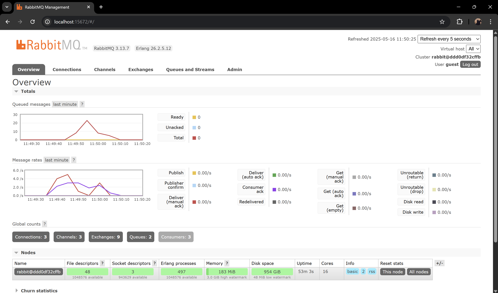
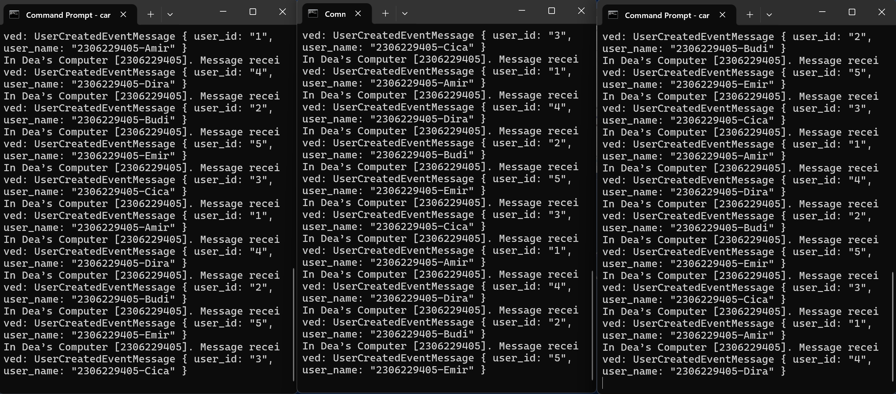

# Module 09
###### Deanita Sekar Kinasih
###### 2306229405

## a. What is amqp?

AMQP (Advanced Message Queuing Protocol) adalah protokol open-standard communication yang dirancang untuk message-oriented middleware. Protokol ini memungkinkan aplikasi untuk melakukan pertukaran pesan secara asynchronous, aman, dan efisien melalui message broker, seperti RabbitMQ. AMQP memisahkan sistem sender dan receiver, memungkinkan keduanya berkomunikasi meskipun beroperasi pada waktu atau kecepatan yang berbeda. Protokol ini menstandardisasi proses messaging, memastikan interoperabilitas di berbagai platform dan teknologi yang berbeda sambil mempertahankan reliability dalam data delivery. AMQP sangat bermanfaat dalam sistem terdistribusi dimana komponen-komponen membutuhkan komunikasi yang scalable, flexible, dan fault-tolerant, seperti dalam microservices architectures. 

## b. What does it mean? `guest:guest@localhost:5672`, what is the first guest, and what is the second guest, and what is localhost:5672 is for?

`guest:guest@localhost:5672` adalah format URL koneksi standar untuk mengakses AMQP message broker, seperti RabbitMQ.

- `guest:guest` adalah format username:password untuk login dengan first guest adalah username autentikasi dan second guest adalah password milik username tersebut.

- `localhost` adalah hostname yang menunjukkan bahwa broker berjalan di local machine.

- `5672` adalah port number yang digunakan secara default untuk menerima koneksi AMQP.

Secara ringkas, URL ini berarti kita sedang terhubung ke AMQP message broker menggunakan username/password default dan port AMQP standar. 

## Simulation slow subscriber:

Untuk simulasi slow subscriber, saya menjalankan perintah `cargo run` sebanyak 2 kali secara cepat. Grafik pada RabbitMQ menujukkan queues 2 yang merepresentasikan jumlah antrean aktif, dengan nilai ready 8 dan unacked 6 yang menunjukkan pesan tertahan dalam antrean. Terjadi proses perlambatan pemrosesan pesan dalam antrean karena penambahan `thread::sleep` pada subscriber. Ketika saya menjalankan publisher beberapa kali dengan `cargo run`, pesan dikirim dengan cepat ke dalam antrean, sementara subscriber tidak mampu memprosesnya dengan kecepatan yang sama. Akibatnya, terjadi ketidakseimbangan antara laju pengiriman dan pemrosesan, menyebabkan akumulasi pesan dalam status ready dan unacked meskipun jumlah antrean tetap 2.

## Running at least three subscribers:

Grafik menunjukkan sistem meiliki 3 konsumen dan 2 antrean. Saat saya menjalankan publisher beberapa kali dengan `cargo run`, terjadi lonjakan hingga 20 pesan, tetapi menurun secara cepat karena terdapat 3 subscriber yang bekerja secara paralel. Aktivitas pengiriman mencapai 4.0/s sementara konsumsi sekitar 3.0/s, menjelaskan mengapa beberapa pesan tertahan sejenak di antrean. Meskipun terdapat `thread::sleep` yang memperlambat subscriber, mekanisme load balancing membuat pemrosesan tetap efisien sehingga mengurangi penumpukan di antrean.

Potensi perbaikan: 
- Implementasi mekanisme acknowledgment yang lebih baik untuk memastikan pesan terproses dengan benar.
- Menerapkan batasan jumlah pesan (prefetch count) untuk setiap subscriber agar beban tetap seimbang.